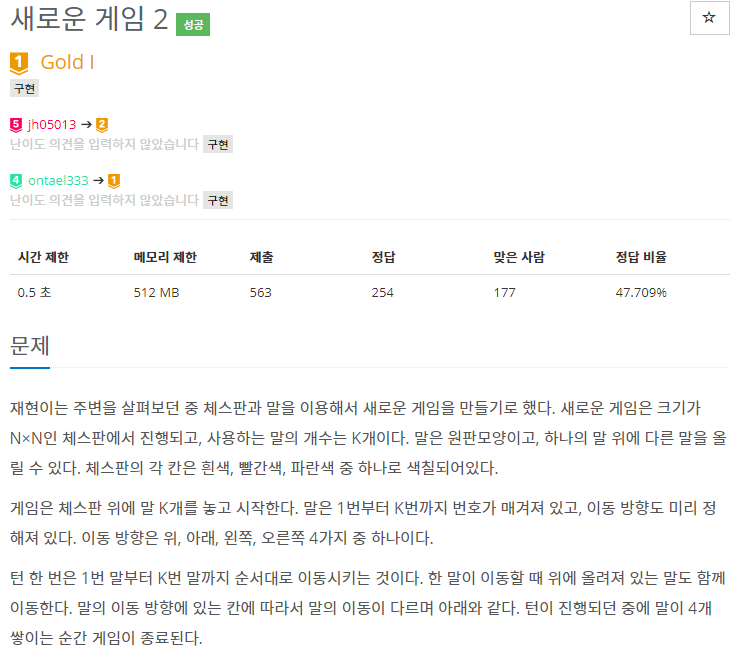
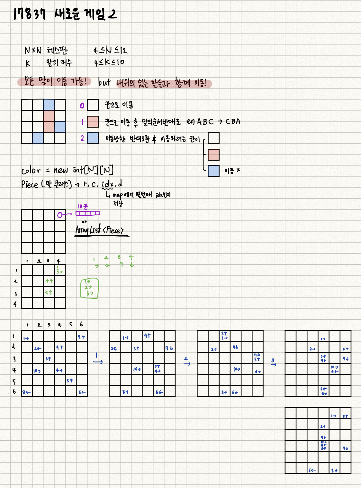

## 자기주도학습 실적

| **학습 형태** | [x ]개별 [] 2인 1조 [ ] 팀별 |
| ------------- | -------------------------- |
| **구성원** | 최현정 |
| **일정** | 09:00 ~ 14:00 |
| **데일리 목표** | 알고리즘 문제 풀기 - 17837번 : 새로운 게임2 |

#### * 주요 내용 요약

- 시뮬레이션 문제

- 

- 

- 

  

