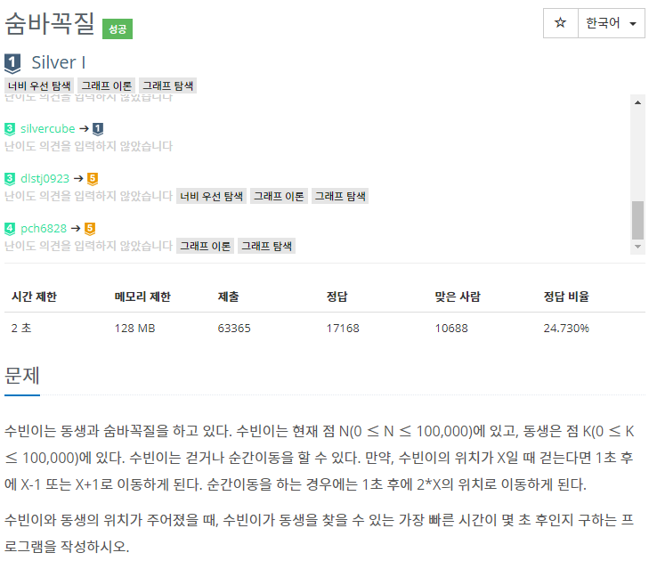

## 자기주도학습 실적


| **학습 형태** | [x ]개별 [] 2인 1조 [ ] 팀별 |
| ------------- | -------------------------- |
| **구성원** | 최현정 |
| **일정** | 09:00 ~ 14:00 |
| **데일리 목표** | 알고리즘 문제 풀기 - 1697번 : 숨바꼭질 |


#### * 주요 내용 요약

- 

  

-  ```java
  import java.util.LinkedList;
  import java.util.Queue;
  import java.util.Scanner;
  
  public class Main_1697_숨바꼭질 {
  
  	static int Answer;
  	static boolean[] visit= new boolean[100001];
  	public static void main(String[] args) {
  		Scanner sc = new Scanner(System.in);
  		int N = sc.nextInt(); //수빈이가 있는 위치 N
  		int K = sc.nextInt(); //수빈이 동생 위치
  		Answer = 0;
  		
  		if( N!=K)
  			bfs(N, K);
  
  		System.out.println(Answer);
  	}
  	
  	private static void bfs(int N, int K) {
  		Queue<int[]> queue = new LinkedList<int[]>();
  		queue.offer(new int[] {N,0});
  		visit[N] = true;
  		
  		while(!queue.isEmpty()) {
  			int[] current = queue.poll();
  			
  			if(current[0]-1 == K) {
  				Answer = current[1] +1;
  				return;
  			}
  			
  			if(current[0]+1 == K) {
  				Answer = current[1] +1;
  				return;
  			}
  			
  			if(current[0]*2 == K) {
  				Answer = current[1] +1;
  				return;
  			}
  			
  			for(int i=0; i<3; i++) {
  				int xx = 0;
  				if(i==0) {
  					xx = current[0]-1;
  				}else if(i==1) {
  					xx = current[0]+1;
  				}else if(i==2) {
  					xx = current[0]*2;
  				}
  				
  				if(xx>=0 && xx<=100000 && !visit[xx]) {
  					queue.offer(new int[] {xx, current[1]+1});
  					visit[xx] = true;
  				}
  			}	
  		}		
  	}
  }
  ```

  
  

