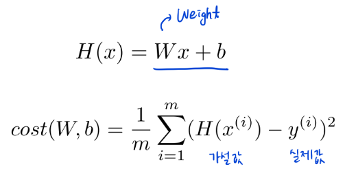
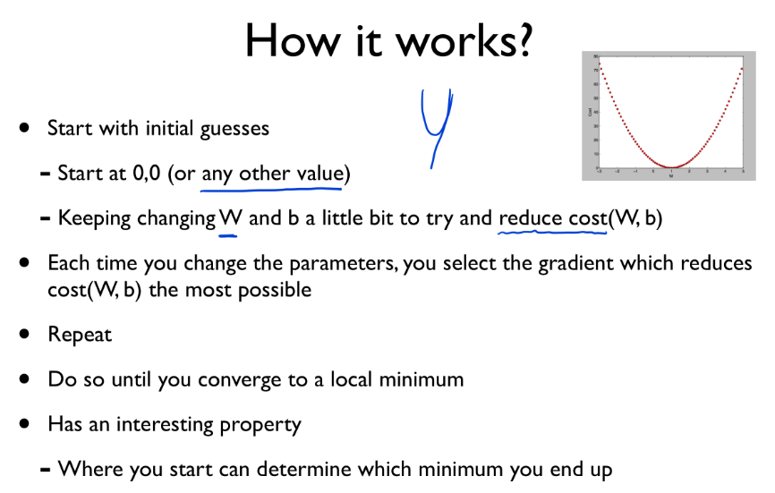
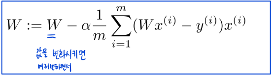
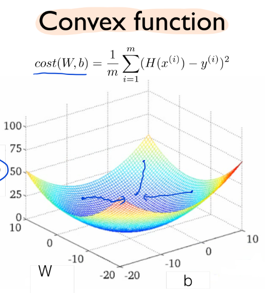

## 자기주도학습 실적

| **학습 형태**   | [x ]개별 [] 2인 1조 [ ] 팀별                   |
| --------------- | ---------------------------------------------- |
| **구성원**      | 최현정                                         |
| **일정**        | 09:00 ~ 14:00                                  |
| **데일리 목표** | Machine Learning 강의 듣기 - Linear Regression |

#### * 주요 내용 요약

- http://hunkim.github.io/ml/
- ML lec 01 기본적인 Machine Learning https://www.youtube.com/watch?v=qPMeuL2LIqY
- Machine Learning는 명시적으로 프로그래밍하지 않으면서 컴퓨터가 학습할 수 있도록 하는 것 ("Field of study that gives computers the ablility to learn without being explicitly programmed")
- Machine Learning은 Supervised Learning과 Unsupervised Learning으로 나누어 짐
  - Supervised Learning : 정해져 있는 데이터(labeled examples)로 학습 
    ex) 이미지 라벨링(개와 고양이 분류)
    - regression
    - binary classification
    - multi-label classification
  - Unsupervised Learning : 데이터를 통해 스스로 학습

- ML lec 02 Linear Regression의 Hypothesis와 cost 설명 https://www.youtube.com/watch?v=Hax03rCn3UI
- Regression 의 가설 H(x) = Wx + b
- Cost function : 실제값과 가설값과의 거리, Loss function이라고도 함
  - H(x) - y나 (H(x)-y)^2을 사용
  - 목적은 cost function 값을 최소화하는 W값 찾기

- ML lec 03 Linear Regression의 cost 최소화 알고리즘의 원리 설명 https://www.youtube.com/watch?v=TxIVr-nk1so
- H와 Cost 함수
  
- Gradient Descent Algorithm : cost function을 최소화하는 값(W, b)을 찾기 위한 알고리즘
- 
- 
- 주의점 cost function의 모양이 Convex function이 되는지 반드시 확인해야 함
  

