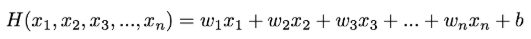
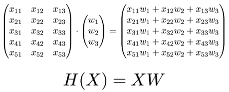
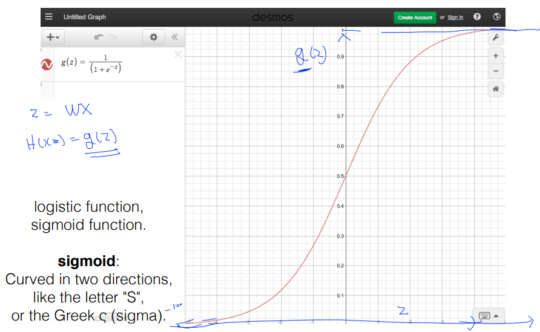
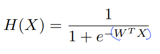
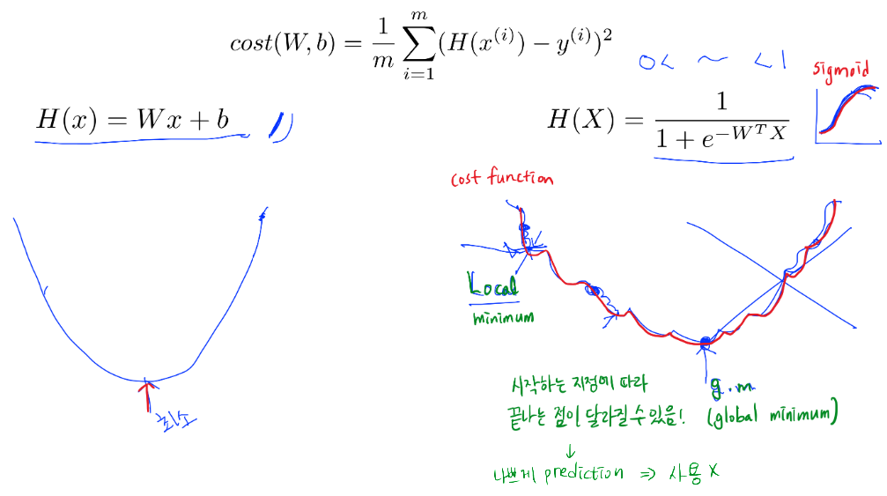
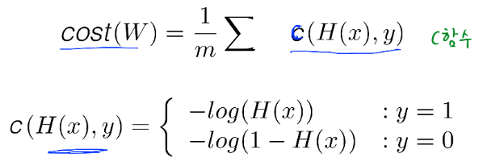
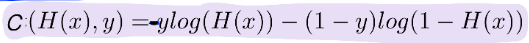

## 자기주도학습 실적

| **학습 형태** | [x ]개별 [] 2인 1조 [ ] 팀별 |
| ------------- | -------------------------- |
| **구성원** | 최현정 |
| **일정** | 09:00 ~ 14:00 |
| **데일리 목표** | Machine Learning 강의 듣기 - Linear Regression, Logistic Classification |

#### * 주요 내용 요약

- http://hunkim.github.io/ml/
- ML lec 04  multi-variable linear regression https://www.youtube.com/watch?v=kPxpJY6fRkY&feature=youtu.be
- Hypothesis
- H(x1, x2, x3) = w1x1 + w2x2 + w3x3 + b
  - 

- Cost function
  - 

- multi-variable linear regression에서는 Matrix를 사용해서 표현한다
  - H(X) = XW
  - 

- ML lec 5-1 Logistic Classification의 가설 함수 정의 https://www.youtube.com/watch?v=PIjno6paszY&feature=youtu.be
- Classification Algorithm 중에서 정확도가 높은 알고리즘
- Binary Classification - 0,1 예측
  - 둘 중 하나의 category 고르기
  - spam detection : spam 메일
  - Facebook feed 특정한 것만 보여주기
  - 신용카드 이상거래 패턴 탐지
  - 악성 종양과 양성 종양 판단
  - 주식 시장 살지 팔지 판단 ...

- 공부 시간에 따른 Pass(1)/Fail(0) 여부 판단 시 Regression을 사용하면 0보다 훨씬 작거나 1보다 훨씬 큰 값이 나올 수 있음
- Logistic function = Sigmoid function
  
- Logistic H(x)
  

- ML lec 5-2 Logistic Regression의 cost 함수 설명 https://www.youtube.com/watch?v=6vzchGYEJBc&feature=youtu.be
- 기존 cost 함수 사용시 문제 발생

- 새로운 Cost Function
  
  프로그래밍 시 복잡하므로 다음과 같이 표현
  

