## 자기주도학습 실적

| **학습 형태** | [x ]개별 [] 2인 1조 [ ] 팀별 |
| ------------- | -------------------------- |
| **구성원** | 최현정 |
| **일정** | 09:00 ~ 14:00 |
| **데일리 목표** | Machine Learning 실습 |

#### * 주요 내용 요약

- ML lab 01 - TensorFlow의 설치및 기본적인 operations (new) https://www.youtube.com/watch?v=-57Ne86Ia8w&feature=youtu.be

- TensorFlow란 open source software library for *numerical computation* using *data flow graphs*.

  - Data Flow Graph
    - Node : mathematical operation (계산)
    - Edge : multidimensional data arrays(tensors) (데이터)

- 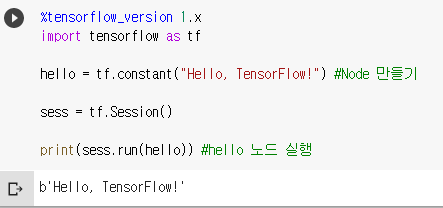

- 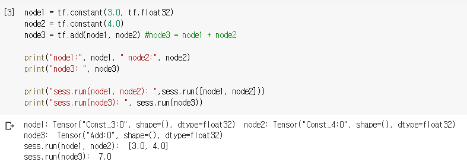

- 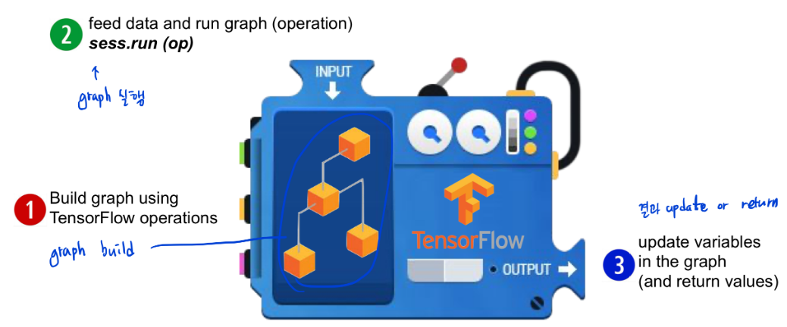

- Placeholder
  미리 모델을 build 한 후에 변수를 대입하는 것
  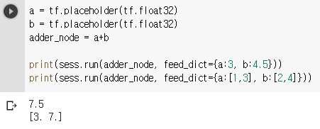 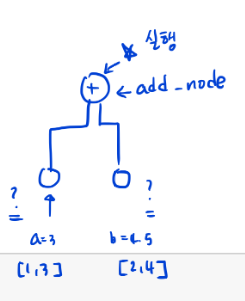

  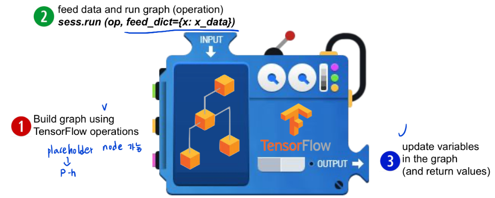

- Ranks : 몇 차원 Array 인지
  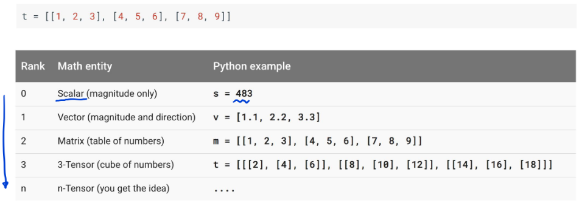
- Shapes 
  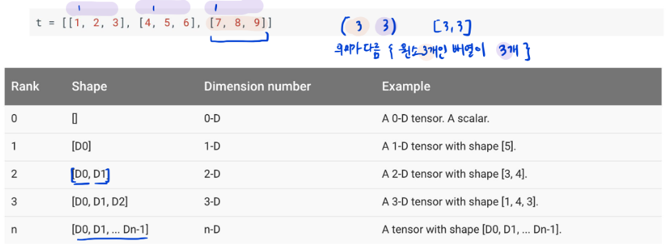

- Types
  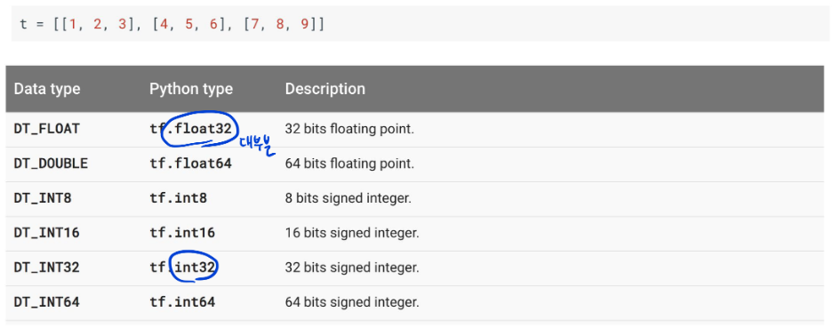

- ML lab 02 - TensorFlow로 간단한 linear regression을 구현 (new)

- Step 1 : 그래프 만들기
  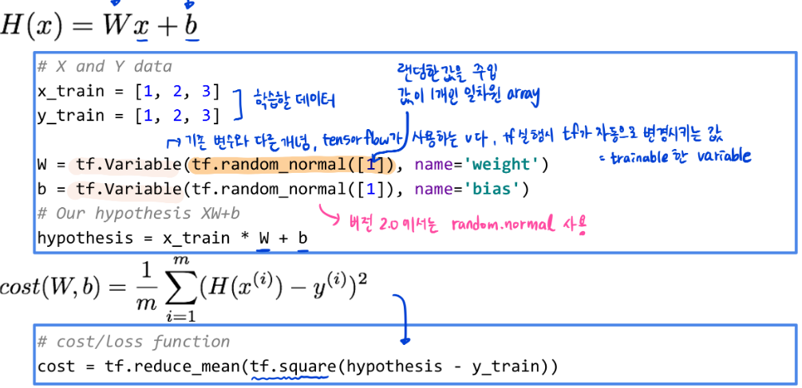
  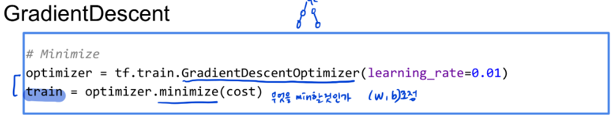

- Step 2. 세션 만들기 및 graph 실행하고 결과값 구하기
  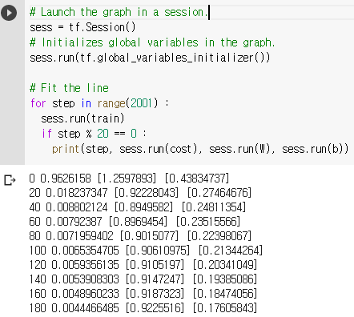

  ​							...
  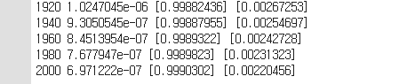

- Placeholder 사용하기
  
  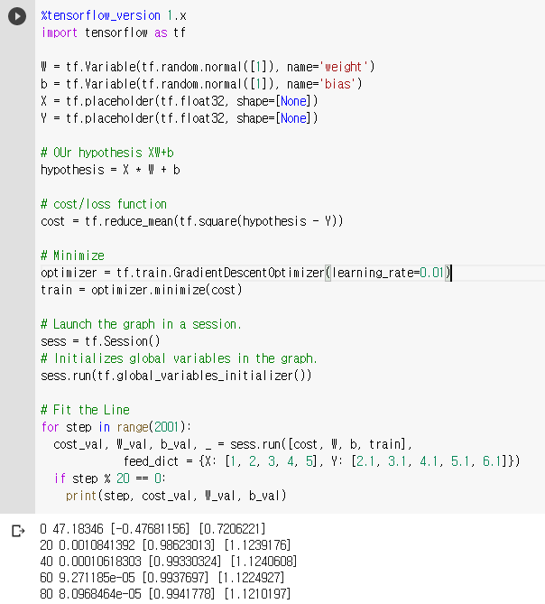
                             ...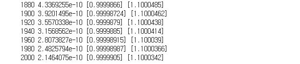
  
  